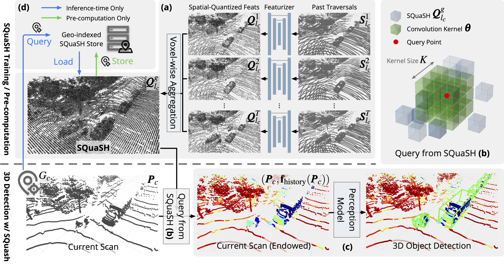

# Hindsight is 20/20: Leveraging Past Traversals to Aid 3D Perception

This is the official code release for

[[ICLR 2022] **Hindsight is 20/20: Leveraging Past Traversals to Aid 3D Perception**](https://openreview.net/forum?id=qsZoGvFiJn1).

by [Yurong You](https://yurongyou.com/), [Katie Z Luo](https://www.cs.cornell.edu/~katieluo/), [Xiangyu Chen](https://www.cs.cornell.edu/~xchen/), Junan Chen, [Wei-Lun Chao](https://sites.google.com/view/wei-lun-harry-chao), [Wen Sun](https://wensun.github.io/), [Bharath Hariharan](http://home.bharathh.info/), [Mark Campbell](https://research.cornell.edu/researchers/mark-campbell), and [Kilian Q. Weinberger](https://www.cs.cornell.edu/~kilian/)

[Video](https://www.youtube.com/watch?v=x_8CUoY8Dxs) | [Paper](https://openreview.net/pdf?id=qsZoGvFiJn1)



### Abstract
Self-driving cars must detect vehicles, pedestrians, and other traffic participants accurately to operate safely. Small, far-away, or highly occluded objects are particularly challenging because there is limited information in the LiDAR point clouds for detecting them. To address this challenge, we leverage valuable information from the past: in particular, data collected in past traversals of the same scene. We posit that these past data, which are typically discarded, provide rich contextual information for disambiguating the above-mentioned challenging cases. To this end, we propose a novel end-to-end trainable Hindsight framework to extract this contextual information from past traversals and store it in an easy-to-query data structure, which can then be leveraged to aid future 3D object detection of the same scene. We show that this framework is compatible with most modern 3D detection architectures and can substantially improve their average precision on multiple autonomous driving datasets, most notably by more than 300% on the challenging cases.

### Citation
```
@inproceedings{you2022hindsight,
  title = {Hindsight is 20/20: Leveraging Past Traversals to Aid 3D Perception},
  author = {You, Yurong and Luo, Katie Z and Chen, Xiangyu and Chen, Junan and Chao, Wei-Lun and Sun, Wen and Hariharan, Bharath and Campbell, Mark and Weinberger, Kilian Q.},
  booktitle = {Proceedings of the International Conference on Learning Representations (ICLR)},
  year = {2022},
  month = apr,
  url = {https://openreview.net/forum?id=qsZoGvFiJn1}
}
```

## Environment
```bash
conda create --name hindsight python=3.8
conda activate hindsight
conda install pytorch=1.9.0 torchvision torchaudio cudatoolkit=11.1 -c pytorch -c nvidia
pip install opencv-python matplotlib wandb scipy tqdm easydict scikit-learn

# ME
git clone https://github.com/NVIDIA/MinkowskiEngine.git
cd MinkowskiEngine
git checkout c854f0c # 0.5.4
python setup.py install
```
for OpenPCDet, follow [`downstream/OpenPCDet/docs/INSTALL.md`](downstream/OpenPCDet/docs/INSTALL.md) to install except
**you should install the spconv with the code in [`third_party/spconv`](third_party/spconv)**.

## Data Pre-processing
Please refer to [`data_preprocessing/lyft/LYFT_PREPROCESSING.md`](data_preprocessing/lyft/LYFT_PREPROCESSING.md) and
[`data_preprocessing/nuscenes/NUSCENES_PREPROCESSING.md`](data_preprocessing/nuscenes/NUSCENES_PREPROCESSING.md).

## Training and Evaluation
We implement the computation of SQuaSH as a submodule in OpenPCDet (as [sparse_query](downstream/OpenPCDet/pcdet/models/history_query/sparse_query.py)) and modify the
[KITTI dataloader](downstream/OpenPCDet/pcdet/datasets/kitti/kitti_dataset.py) / [augmentor](downstream/OpenPCDet/pcdet/datasets/augmentor/data_augmentor.py) to load the history traversals.

We include the corresponding configs of four detection models in
[downstream/OpenPCDet/tools/cfgs/lyft_models](downstream/OpenPCDet/tools/cfgs/lyft_models)
and [downstream/OpenPCDet/tools/cfgs/nuscenes_boston_models](downstream/OpenPCDet/tools/cfgs/nuscenes_boston_models).
Please use them to train/evaluate corresponding base-detectors/base-detectors+Hindsight models.

### Train:
We use 4 GPUs to train detection models by default.
```bash
cd downstream/OpenPCDet/tools
OMP_NUM_THREADS=6 bash scripts/dist_train.sh 4 --cfg_file <cfg> --merge_all_iters_to_one_epoch --fix_random_seed
```

### Evaluation:
```bash
cd downstream/OpenPCDet/tools
OMP_NUM_THREADS=6 bash scripts/dist_test.sh 4 --cfg_file <cfg> --ckpt <ckpt_path>
```

## Checkpoints
### Lyft experiments
| Model | Checkpoint  | Config file |
| ----- | :----: | :----: |
| PointPillars | [link](https://drive.google.com/file/d/1N1N0wKeSGtvwBad3iNHgbTGwyFU0q36z/view?usp=sharing) | [cfg](downstream/OpenPCDet/tools/cfgs/lyft_models/pointpillar.yaml) |
| PointPillars+Hindsight | [link](https://drive.google.com/file/d/1piZuMhSoG2Ea3JPzXwg4VVfGCLFD3NtV/view?usp=sharing) | [cfg](downstream/OpenPCDet/tools/cfgs/lyft_models/pointpillar_hindsight.yaml) |
| SECOND | [link](https://drive.google.com/file/d/1gnmUdc99EykRq1KOOI-bgXApc99T-MvW/view?usp=sharing) | [cfg](downstream/OpenPCDet/tools/cfgs/lyft_models/second_multihead.yaml) |
| SECOND+Hindsight | [link](https://drive.google.com/file/d/1EG4oZm9d-hvGLKMpQ4zQZgUbcZsFXuxR/view?usp=sharing) | [cfg](downstream/OpenPCDet/tools/cfgs/lyft_models/second_multihead_hindsight.yaml) |
| PointRCNN | [link](https://drive.google.com/file/d/1UT5QYoG0X0dpSM6Bs4B6NXdwiHSTkApj/view?usp=sharing) | [cfg](downstream/OpenPCDet/tools/cfgs/lyft_models/pointrcnn.yaml) |
| PointRCNN+Hindsight | [link](https://drive.google.com/file/d/1_8IgExDAd80rQchVok1RLPjv4t29O51X/view?usp=sharing) | [cfg](downstream/OpenPCDet/tools/cfgs/lyft_models/pointrcnn_hindsight.yaml) |
| PV-RCNN | [link](https://drive.google.com/file/d/11EZuEaLc4J618kwXqte3uBw4BXhYvwXA/view?usp=sharing) | [cfg](downstream/OpenPCDet/tools/cfgs/lyft_models/pv_rcnn.yaml) |
| PV-RCNN+Hindsight | [link](https://drive.google.com/file/d/1WgB42dYGawQUrPLeejSNOc-ddc-iFn9H/view?usp=sharing) | [cfg](downstream/OpenPCDet/tools/cfgs/lyft_models/pv_rcnn_hindsight.yaml) |

### nuScenes experiments
| Model | Checkpoint  | Config file |
| ----- | :----: | :----: |
| PointPillars | [link](https://drive.google.com/file/d/1Cn-YVsAwGn91vVaXf2LjOqL0KJ453v4u/view?usp=sharing) | [cfg](downstream/OpenPCDet/tools/cfgs/nuscenes_boston_models/pointpillar.yaml) |
| PointPillars+Hindsight | [link](https://drive.google.com/file/d/1pIUvdqOeS5OOZkseAyPUnlbo8T8BGqiB/view?usp=sharing) | [cfg](downstream/OpenPCDet/tools/cfgs/nuscenes_boston_models/pointpillar_hindsight.yaml) |
| PointRCNN | [link](https://drive.google.com/file/d/1HUGV8zCiUfg6S_xXeOlLO-JfFNMaVzc9/view?usp=sharing) | [cfg](downstream/OpenPCDet/tools/cfgs/nuscenes_boston_models/pointrcnn.yaml) |
| PointRCNN+Hindsight | [link](https://drive.google.com/file/d/1xUhCYpsZqt_VJaQF0YUcNFFTbpgNCHwE/view?usp=sharing) | [cfg](downstream/OpenPCDet/tools/cfgs/nuscenes_boston_models/pointrcnn_hindsight.yaml) |
## License
This project is under the MIT License.
We use [OpenPCDet](https://github.com/open-mmlab/OpenPCDet) and [spconv](https://github.com/traveller59/spconv) in this project and they are under the Apache-2.0 License.
We list our changes [here](CHANGES.md).

## Contact
Please open an issue if you have any questions about using this repo.

## Acknowledgement
This work uses [OpenPCDet](https://github.com/open-mmlab/OpenPCDet), [MinkowskiEngine
](https://github.com/NVIDIA/MinkowskiEngine) and [spconv](https://github.com/traveller59/spconv).
We thank them for open-sourcing excellent libraries for 3D understanding tasks.
We also use the scripts from [3D_adapt_auto_driving](https://github.com/cxy1997/3D_adapt_auto_driving) for converting Lyft and nuScenes dataset into KITTI format.